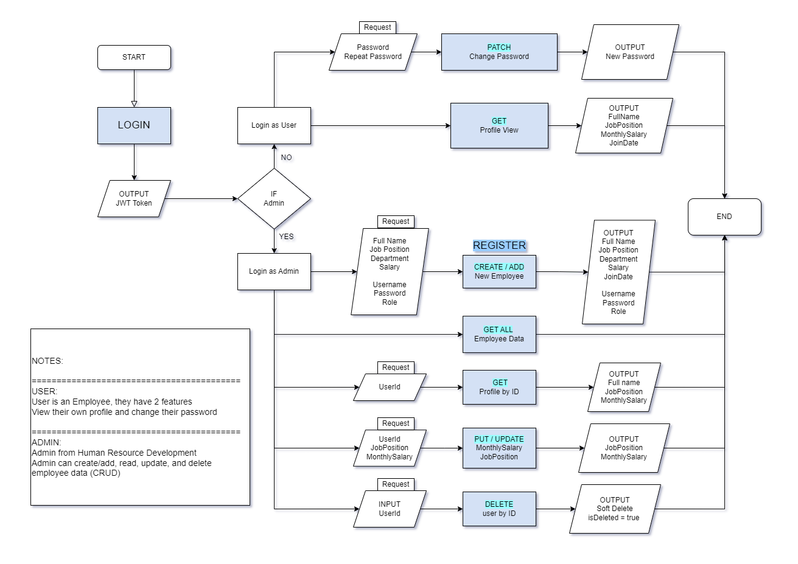
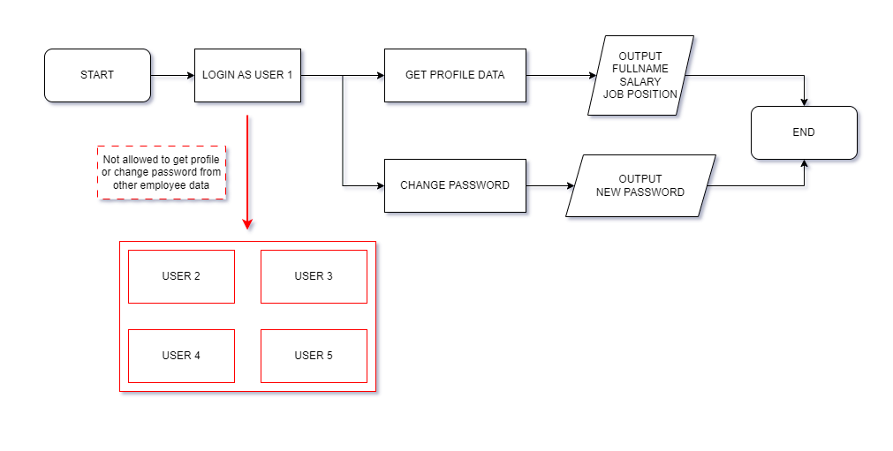
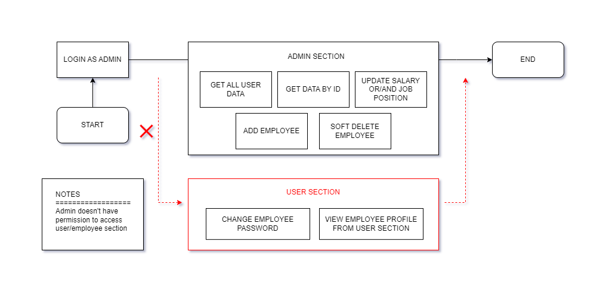
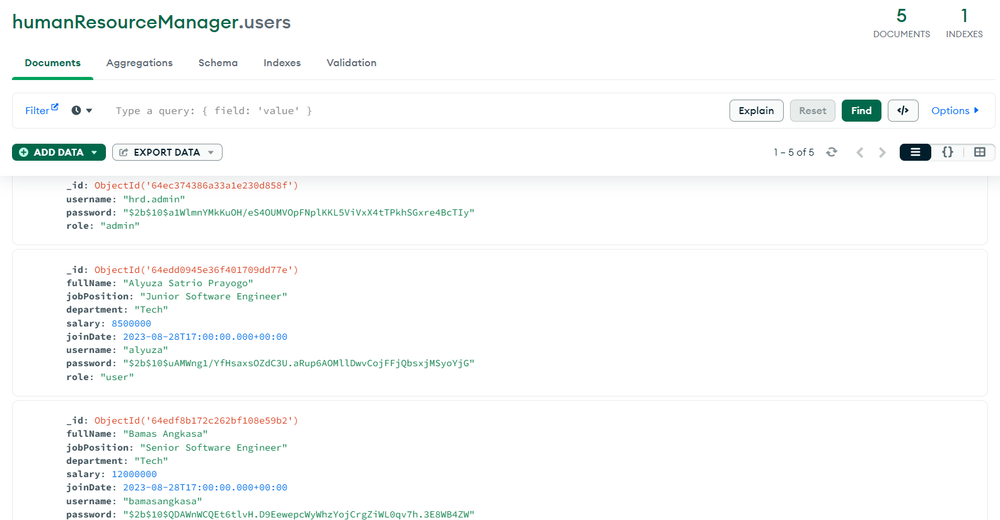
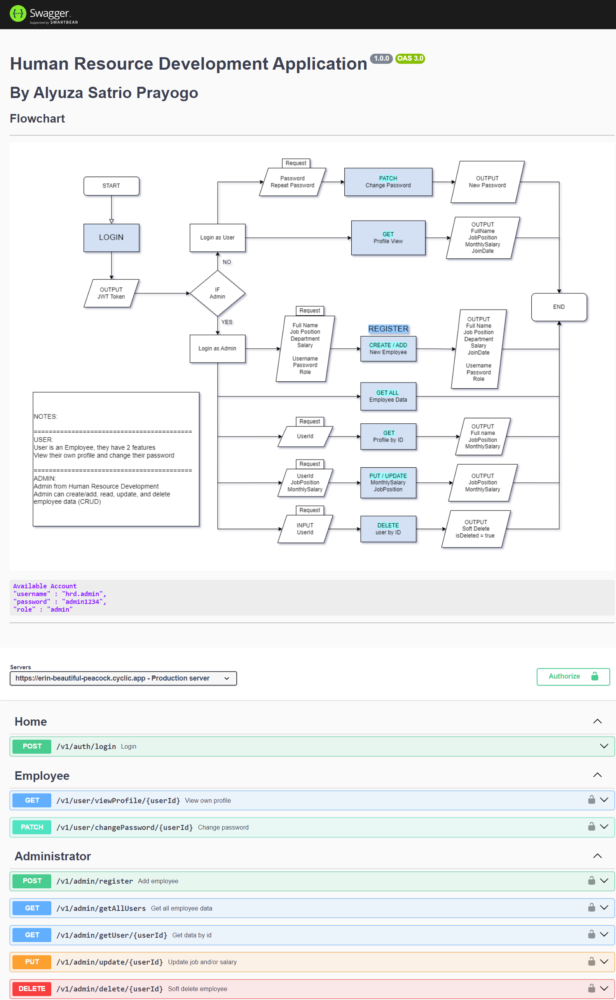

<!-- [](https://classroom.github.com/a/XqBuIcOG) -->
# Project Milestone 2
---
# Human Resource Development Application
An HRD application designed to streamline employee management. This application allows 'Administrators' to register new employee, read all employee data profiles, update their salary / job position, and can soft delete employee profile for enhanced data control.

For Employees 'user', they can log in using their provided username and password, granting them access to their personal profiles only. They can view and modify their profiles, including the ability to update passwords.

With Role-Based Access Control (RBAC), this HR application empowers organizations to manage their workforce effectively, ensuring data security and efficient employee management.

---

## Tools & Ingredients

- Node.js & Express.js
- Swagger UI -> API documentation
- MongoDB Atlas -> Database server
- MongoDB Compass -> Database monitor
- Postman -> API development
- DrawerIO -> Create a flowchart

---

## Main Flowchart



---

## User Access

The way to prevent employees from accessing other employee profiles is to enter the value username/id (login) = value username/id in the (View Profile) or (Change Password) methods. Then employees cannot access other employee profiles.



1. Encode username using JWT in Authentication.

`const token = jwt.sign({ username: user.username }, JWT_SIGN)`

2. Decode JWT, and username will be displayed in Authorization.

`const decodedToken = jwt.verify(token, JWT_SIGN)`
`console.log(decodedToken, 'Token has been decoded');`

3. Use `res.locals.username` to automatically insert data into findOne method. There is no need for input based on ID/username so employees cannot view other employee profiles based on ID/username.

```const viewProfile = async (req, res) => {
  const usernameInput = res.locals.username;
  try {
    // find data by username in mongoDB server
    const user = await req.db.collection('users').findOne({
      username: usernameInput,
      is_deleted: { $exists: false }
    });
    if (user) {
      return res.status(200).json({ message: `Success get own profile.`,
      data: user });
    } else {
      return res.status(404).json({ message: `User not found or deleted.` });
    }
  } catch (error) {
    return res.status(500).json({ error: error.message });
  }
};
```

---

## Admin Access

To restrict admin and user access, you can use Authorization with 'Role Based Access Control'.

In this case there are only 2 roles, Admin and User/Employee. Admin can access user data through the `Admin Area` using `Get all user data` or `Get data by ID`, but admin do not have permission to enter the `User Area` to do `Change Password` or `View Profile`.



1. `Login` -> `Username` and `Role` will be encoded/sign in JWT, the output of this encoding is random and requires a secret key to match or unlock the code. The output of the code below is `token`.

```
const token = jwt.sign({ username: user.username, role: user.role }, JWT_SIGN)
    res.status(200).json({
      message: 'Successfully logged in',
      data: token
    });
```

2. `Authorization` -> `JWT_SIGN` is `secret key` to open/match the `token`, you need to have the same secret key that was used to sign-in in `Login`.

`jwt.verify(token, JWT_SIGN)` is a function used to verify the integrity and authenticity of a JWT by checking its signature against a secret key. If the signature matches, it means the JWT is valid and can be trusted, and you can then proceed to use the information contained in the JWT payload. If the signature does not match, the JWT is invalid, and you should not trust its contents.

```
const decodedToken = jwt.verify(token, JWT_SIGN)
      if (decodedToken.role.toLowerCase() === 'user') {
        next()
      } else {
        res.status(401).json({ error: `Sorry you don't have permission in 'Employee' section.` })
      }
```

When the role is an `user` it will be allowed to access this section.
When the role is other than `user`, example: `admin`, it is not permitted to access this section.

---

## Features
### Admin Features
**Add New Employee**

- **Description:** Allows admin to add a new employee to the system.
- **Steps:**
  1. Log in as an admin.
  2. Navigate to the "Add Employee" section.
  3. Fill in the employee details such as fullname, department, job position, salary, username and password.
  4. Click "Add" to save the employee information.

**List All Employees**

- **Description:** Displays a list of all employees in the system.
- **Steps:**
  1. Log in as an admin.
  2. Navigate to the "Employee List" section.
  3. View the list of all employees with basic details.

**List Employee by ID**

- **Description:** Allows the admin to find and view an employee's details by their unique ID.
- **Steps:**
  1. Log in as an admin.
  2. Navigate to the "Employee List" section.
  3. Enter the employee's ID to retrieve and display their details.

**Update Job Position & Salary**

- **Description:** Enables the admin to update an employee's job position and salary.
- **Steps:**
  1. Log in as an admin.
  2. Navigate to the "Employee List" section.
  3. Find the employee whose details need to be updated.
  4. Edit the job position and/or salary fields.
  5. Click "Save" to update the information.

**Soft Delete Employee**

- **Description:** Allows the admin to mark an employee as inactive without permanently removing them.
- **Steps:**
  1. Log in as an admin.
  2. Navigate to the "Employee List" section.
  3. Locate the employee to be soft-deleted.
  4. Choose the "Soft Delete" option to deactivate the employee.
---

### Employee Features

**Change Password**

- **Description:** Enables an employee to change their login password.
- **Steps:**
  1. Log in as an employee.
  2. Navigate to the "Change Password" section in the profile settings.
  3. Enter the new password and repeat password.
  4. Click "Change Password" to save the new password.

**View Own Profile**

- **Description:** Allows an employee to view their own profile information.
- **Steps:**
  1. Log in as an employee.
  2. Access the "Profile" section.
  3. View personal details such as name, job position, and salary.

**Restriction on Viewing Other Profiles**

- **Description:** Prevents employees from viewing profiles of other employees.

---

**Available Account**
```
{
    "username" : "hrd.admin",
    "password" : "admin1234",
    "role" : "admin"
}
```
```
{
  "username": "alyuza",
  "password": "user1234"
  "role": "user"
}
```
---

## API Endpoint | Request & Response

| Endpoint | Method | Description | Request Body | Response |
|---------|--------|--------|--------|--------|
| `/v1/auth/login` | POST | Login | `username:string`<br>`password:string` | `JWT Token` |
| `/v1/user/viewProfile/:id` | GET | View profile | Automatically input Username from JWT | `_id:string`<br>`fullName:string`<br>`jobPosition:string`<br>`department:string`<br>`salary:integer`<br>`joinDate:date`<br>`username:string`<br>`password:hashedPassword`<br>`role:string` |
| `/v1/user/changePassword/:id` | PATCH | Change password | `password:string`<br>`repeatPassword:string` | `New Password` |
| `/v1/admin/register` | POST | Add new employee | `fullName:string`<br>`jobPosition:string`<br>`department:string`<br>`salary:integer`<br>`username:string`<br>`password:string`<br>`repeatPassword:string`<br>`role:string` | `Input data to MongoDB Atlas`|
| `/v1/admin/getAllUsers` | GET | Get all employee data | N/A | `List all employee data` |
| `/v1/admin/getUser/:id` | GET | Get employee data by ID | `UserID:string` | `Get data from 1 employee by ID` |
| `/v1/admin/update/:id` | PUT | Update employee job and/or salary | `salary:integer`<br>`jobPosition:string` | `New Position` <br>and/or<br> `New Salary` |
| `/v1/admin/delete/:id` | DELETE | Soft delete employee | `UserID:string` | `UserID = isDeleted_true` |

---

## Database in MongoDB Server


---

## Swagger UI


---

## Deployment
Deployment link here [https://erin-beautiful-peacock.cyclic.app/api-docs/#/](https://erin-beautiful-peacock.cyclic.app/api-docs/#/)

---
## Contact Person
[](https://www.linkedin.com/in/alyuzasp/) [](https://www.youtube.com/@alyuza/about) [](https://www.instagram.com/alyuuza/)
